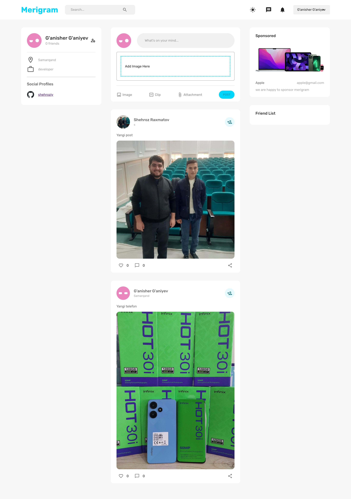
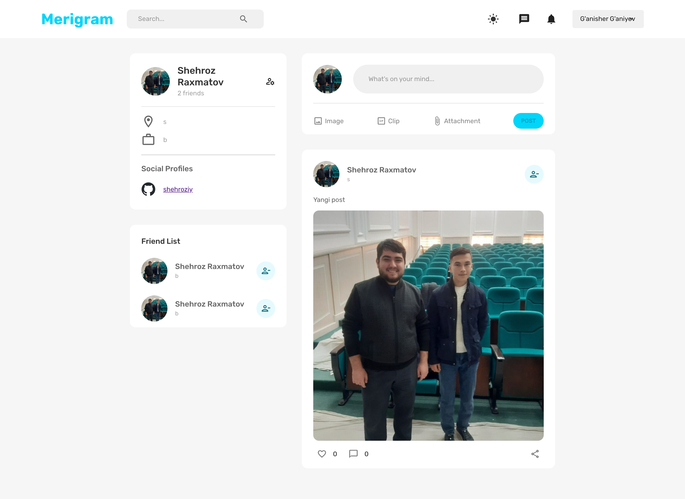
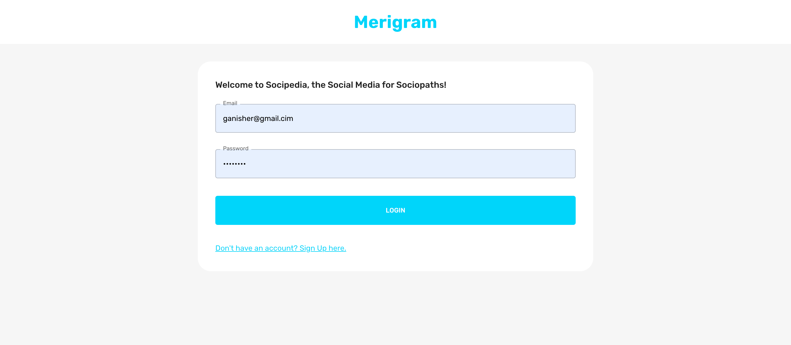
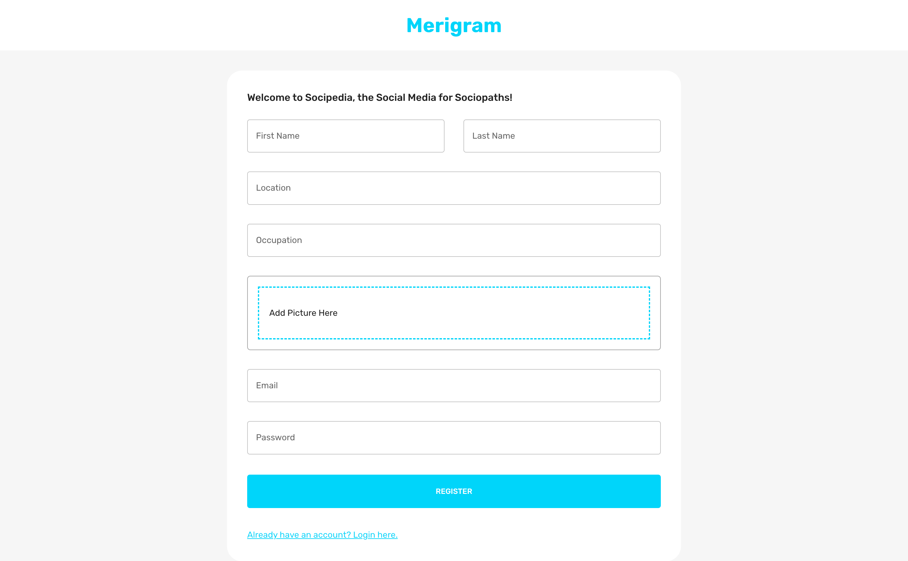

# FullStack Social Media App

# Loyihani ishga tushirish uchun qo'llanma:
<p>Client papkasini ishga tushirish uchun</p>

```
npm install
npm start
```

<p>server papkani ishga tushirish uchun</p>

```
npm install
npm run dev
```

### dotenv file ni ishlatishingiz mumkin

<p>Serverda xatolik tufayli sayt serverga joylanmagan</p>

# HOME


# FRIENDS PROFILE


# LOGIN


# SIGNIN
 
